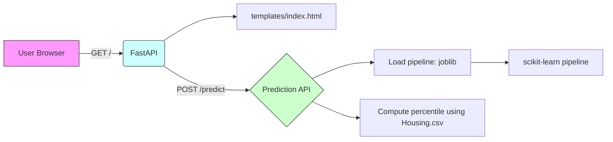

# House Price Predictor — Final README

## Quick Links

- [Run locally](#run-locally)
- [Architecture](#architecture)
- [API Examples](#api-examples)
- [Data & Model Notes](#data--model-notes)
- [Next Steps](#next-steps)
---

## Overview

This repository implements a small FastAPI web application that serves a single-page client and a `/predict` endpoint backed by a serialized scikit-learn pipeline. The app demonstrates a complete prediction flow: user inputs → model prediction → percentile against dataset.

---
## Architecture



This simple diagram shows the request flow: the browser serves a static client, which posts JSON to `/predict`. The API loads a serialized pipeline and the CSV dataset to compute a percentile for context.

---

## API Examples

Use the API directly from curl or any HTTP client.

curl example:

```bash
curl -s -X POST http://127.0.0.1:8000/predict \
  -H "Content-Type: application/json" \
  -d '{"area":2300,"bedrooms":3,"bathrooms":2,"stories":1,"mainroad":1,"guestroom":0,"basement":0,"hotwaterheating":0,"airconditioning":1,"parking":2,"prefarea":1,"furnishingstatus":0}'
```

Python example using `requests`:

```python
import requests

payload = {
  "area":2300,
  "bedrooms":3,
  "bathrooms":2,
  "stories":1,
  "mainroad":1,
  "guestroom":0,
  "basement":0,
  "hotwaterheating":0,
  "airconditioning":1,
  "parking":2,
  "prefarea":1,
  "furnishingstatus":0
}
resp = requests.post('http://127.0.0.1:8000/predict', json=payload)
print(resp.json())
```

---

## Data & Model Notes

- `Housing.csv` must contain the `price` column used to compute percentiles.
- `main.py` expects `house_price_pipeline.pkl` at the repo root. The object should support `.predict(X)`.
- The Pydantic `House` schema defines the input fields and types.

Model training checklist (recommended):

1. Split dataset (train / val / test).
2. Build a scikit-learn pipeline with necessary preprocessing (scaling, one-hot or ordinal encoding for categorical fields).
3. Train, evaluate (RMSE, R²), and persist the pipeline with `joblib.dump(pipeline, 'house_price_pipeline.pkl')`.

---

## Run locally

1. Create and activate a venv, then install deps:

```bash
python -m venv .venv
source .venv/bin/activate
pip install -r requirements.txt
```

2. Ensure `house_price_pipeline.pkl` is present.

3. Start the app:

```bash
uvicorn main:app --reload --port 8000
```

Open `http://127.0.0.1:8000/` to use the UI.

---

## Suggested improvements

- Add input validation and helpful error messages for the API.
- Include a `models/` directory with saved pipelines and metadata (training date, metrics, hyperparameters).
- Add a `Dockerfile` and `docker-compose.yml` for containerized runs.
- Add automated tests for the `/predict` endpoint using `pytest` and `httpx` and integrate them in CI.

---

## Next steps I can do for you

- Produce a small `Dockerfile` and `docker-compose.yml` for local deployment.
- Add a minimal `tests/test_predict.py` suite and a GitHub Actions workflow for CI.
- Help retrain the model and produce a reproducible training script or notebook.

If you'd like one of these, tell me which and I'll create it and update the repository.
